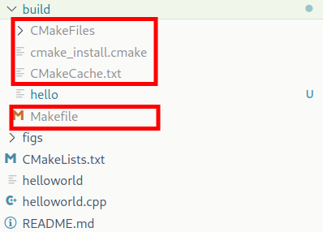

# First Cpp program & build it with CMake

## Compile the program & run it

```bash
g++ -o helloworld helloworld.cpp
# if don't have -o option, the default output file is a.out
```

```bash
./helloworld 
# run the program
# output: Hello World!
# if you don't have ./helloworld permission, you can use chmod +x helloworld to give the permission
# if helloworld is added to PATH of system, you can run it by `helloworld` command
```

## Clean the compiled file

```bash
rm helloworld
```

## Compile the program with debug information

```bash
g++ -g -o helloworld helloworld.cpp
gdb helloworld
```

## Build the program with makefile

```bash
cd build && cmake .. && make 
# cmake ..: generate makefile of parent folder
# make: compile the program
# if you want to clean the compiled files, you can use `make clean` - that will remove `hello` file just created
# '.' is the current directory that contains CMakeLists.txt file with cmake configuration 
# and C programs

# after that you can run `hello` file just created
# with `hello` is the project name in CMakeLists.txt configuration
```

## Result


