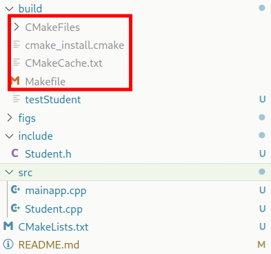

# How to run CMake a project C with multi directory

## Setup code

```bash
cd . # . is project path
mkdir include src build
touch CMakeLists.txt
touch include/Student.h
touch src/Student.cpp src/mainapp.cpp
```

Now the structure of the project:

```bash
.               # project folder
|___include/    # the header file (.h)
|___src/        # the src file (.cpp)
|___build/      # the bin file & temp file when CMake build
|
|___CMakeLists.txt  # the file configuration CMake
```

## Note about the CMakeLists.txt

```bash
cmake_minimum_required(VERSION 3.30.3)
# current newest cmake version of the system

project(directory_test)
# setup project name 
# - that will generate a new file with project name

include_directories(include)
# make project include header files (.h) in build env

#set(SOURCES src/mainapp.cpp src/Student.cpp)
# command to add src file to build env
# however we can make shorter by this command
file(GLOB SOURCES "src/*.cpp")

add_executable(testStudent ${SOURCES})
# sử dụng biến SOURCE 
# thay vì việc sử dụng tham chiếu cụ thể của từng source file 
# để build một chương trình executable là testStudent
```

## Build cmake and run make

```bash
# in build folder
cd build && cmake .. && make
```

## After run `cmake ..` & `make`



Các tệp và thư mục có chức năng như sau:

1. **`CMakeFiles` (thư mục)**: Thư mục này được tạo ra bởi CMake và chứa các tệp tạm thời cần thiết để CMake quản lý quá trình biên dịch và liên kết. Đây là thư mục chứa metadata và thông tin của quá trình build.

2. **`cmake_install.cmake`**: Tệp này được tạo ra bởi CMake để xử lý quá trình cài đặt (install) khi bạn chạy lệnh `make install`. Nó chứa các hướng dẫn về cách di chuyển các file sau khi được biên dịch đến vị trí cài đặt (ví dụ: `/usr/local/bin`).

3. **`CMakeCache.txt`**: Tệp này là bộ nhớ đệm (cache) mà CMake sử dụng để lưu trữ các tùy chọn cấu hình của dự án sau khi chạy lệnh `cmake`. Nó lưu thông tin về các biến và đường dẫn cần thiết cho quá trình biên dịch.

4. **`Makefile`**: Tệp `Makefile` này được CMake tạo ra để hướng dẫn công cụ `make` thực hiện các bước biên dịch mã nguồn của bạn (biên dịch, liên kết, v.v.). Đây là tệp rất quan trọng để có thể chạy `make` sau khi CMake đã thiết lập cấu hình.

### Bạn có thể xóa chúng không?

- **`CMakeFiles`, `cmake_install.cmake`, `CMakeCache.txt`**: Đây là các tệp và thư mục tạm thời được tạo ra sau khi chạy `cmake`. Bạn có thể xóa chúng an toàn nếu không cần tiếp tục sử dụng cấu hình và build đã được tạo ra. Tuy nhiên, nếu bạn muốn biên dịch lại sau này mà không cần chạy lại `cmake`, thì nên giữ lại chúng.
  
- **`Makefile`**: Nếu bạn muốn sử dụng `make` để biên dịch lại chương trình mà không cần phải chạy `cmake` lại, thì không nên xóa. Nếu bạn xóa nó, bạn sẽ phải chạy lại `cmake` để tạo lại `Makefile`.

Tóm lại, các tệp và thư mục trong khung đỏ đều có thể xóa được mà không ảnh hưởng đến mã nguồn của bạn. Tuy nhiên, nếu bạn định build lại chương trình sau khi xóa chúng, bạn sẽ cần phải chạy lại CMake để tái tạo những tệp này.

$\to$ After all (if done) $\to$ can remove all what make create except the `bin file`. Eg in this case: `testStudent`
